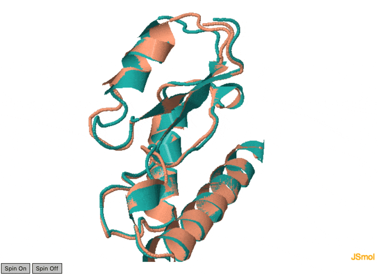

# Домашнее задание 5

### Последовательность

```
MDADVISFEASRGDLVVLDAIHDARFETEAGPGVYDIHSPRIPSEKEIEDRIYEILDKIDVKKVWINPDCGLKTRGNDETWPSLEHLVAAAKAVRARLDK
```

**Программы-предсказатели:** ESMFold, AlphaFold2

**Инструмент парного выравнивания:** CLICK

### Ноутбуки `.ipynb`

1. [ESMFold](./ESMFold.ipynb)

2. [AlphaFold2](./AlphaFold2.ipynb)

### Предсказанные структуры `.pdb`

1. ESMFold: [ptm0.787_r3_default.pdb](./ESMFold_Predictions/ptm0.787_r3_default.pdb)

2. AlphaFold2: [Assignment5_73f88_unrelaxed_rank_1_model_3.pdb](./AlphaFold2_Predictions/Assignment5_73f88_unrelaxed_rank_1_model_3.pdb)

### Результат выравнивания



| Structure Overlap | RMSD | Fragment Score | Topology Score | # CA atoms of ptm0.787_r3_default | # CA atoms of Assignment6_73f88_unrelaxed_rank_1_model_3 | Match Size | #Identical Residues | #Identical Residues with Heuristics |
| ----------------- | ---- | -------------- | -------------- | --------------------------------- | -------------------------------------------------------- | ---------- | ------------------- | ----------------------------------- |
| 99.00%            | 0.93 | 1.00           | 1.00           | 100                               | 100                                                      | 99         | 98                  | 98                                  |

```shell
                                                          10        20        30        40        50        60        70        80        90        100     
ptm0.787_r3_default                           1A:MDADVISFEASR-GDLVVLDAIHDARFETEAGPGVYDIHSPRIPSEKEIEDRIYEILDKIDVKKVWINPDCGLKTRGNDETWPSLEHLVAAAKAVRARLDK:100A 
Assignment5_73f88_unrelaxed_rank_1_model_3    1A:MDADVISFEASRGD-LVVLDAIHDARFETEAGPGVYDIHSPRIPSEKEIEDRIYEILDKIDVKKVWINPDCGLKTRGNDETWPSLEHLVAAAKAVRARLDK:100A 
```

- [Alignment 1 in PIR format](./CLICK_Alignment/Alignment.pir)

- [Matched residue pairs 1](./CLICK_Alignment/Pairs.txt)

### Выводы

Полученные предсказания совпадают на 99%, есть лишь незначительные визуальные несовпадения 
